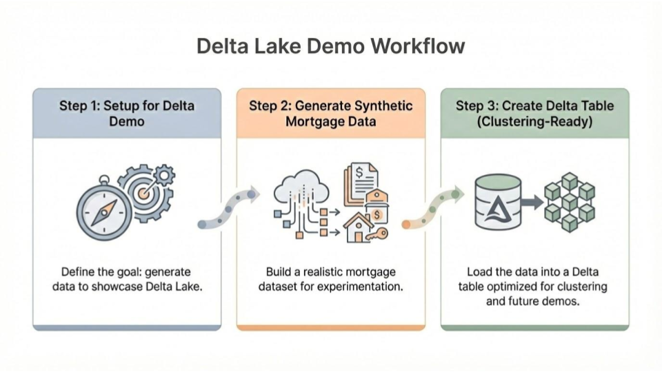
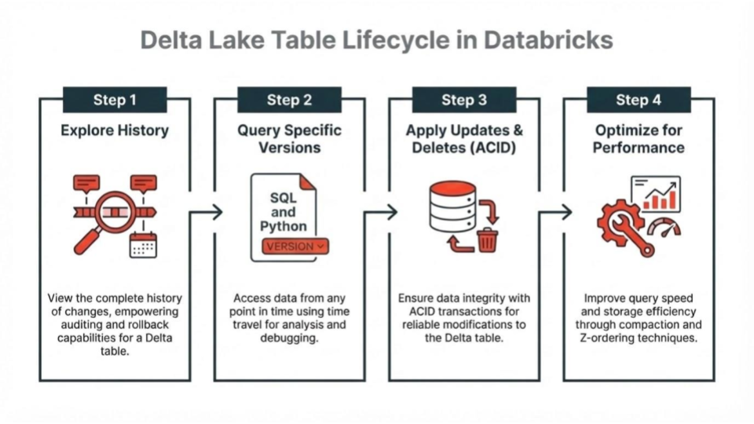
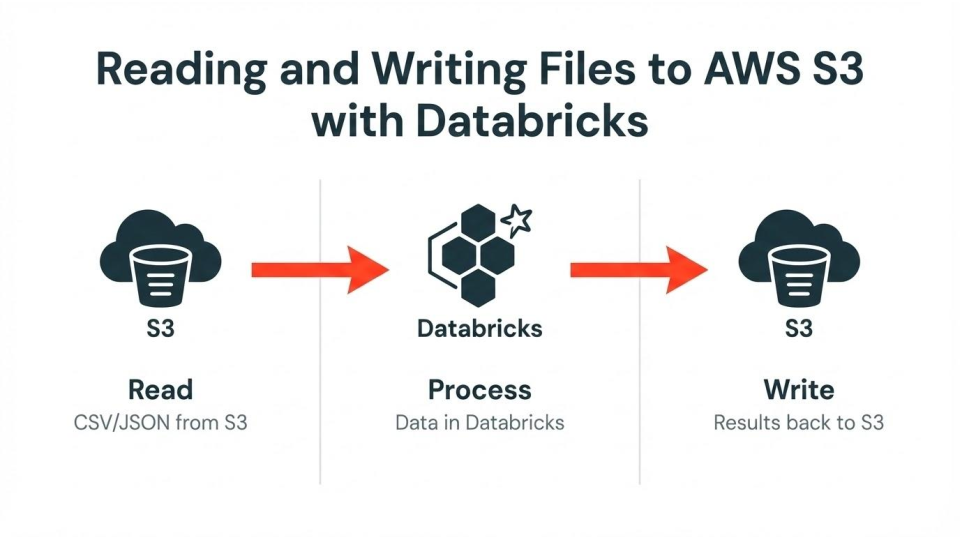
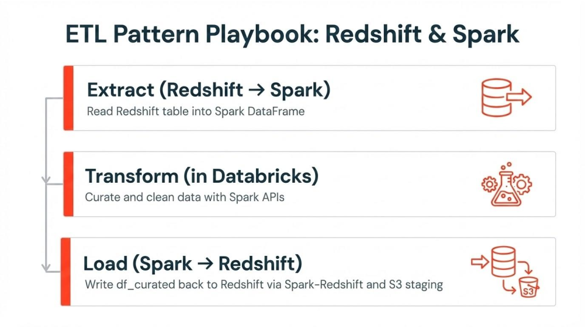
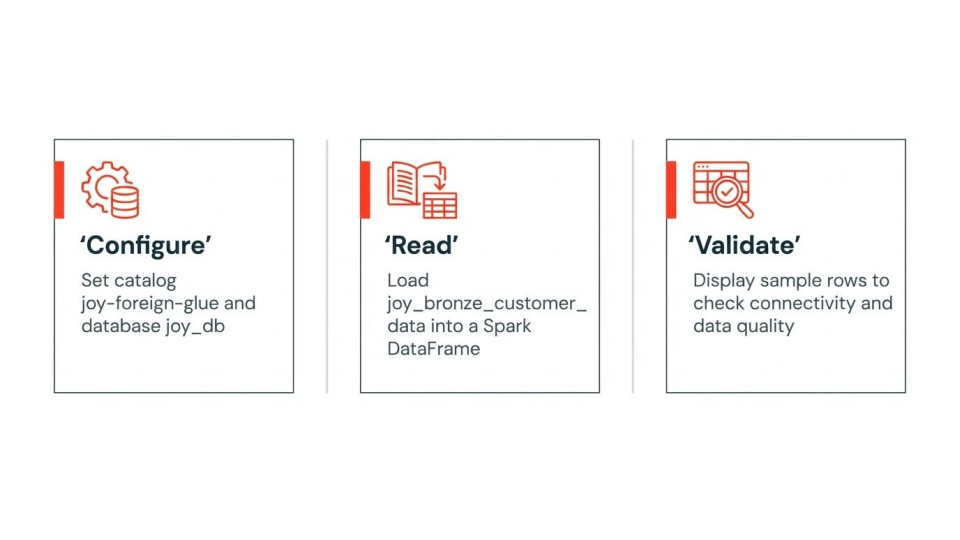

# ETL Logging Native, Glue, and Redshift 

## Setup Notebook
This notebook walks through a complete, hands-on setup for a Delta Lake demo using synthetic mortgage data. It begins by clearly stating the goal: generate a self-contained dataset that can be used to illustrate key Delta Lake capabilities. It then guides you through creating a realistic mortgage dataset, which serves as the foundation for all subsequent Delta operations. Finally, it shows how to materialize that data as a clustering-ready Delta table, positioning it for later demonstrations of performance optimization and advanced Delta features such as clustering and time-travel queries.

## Delta Lake Notebook
This notebook is your hands-on tour of how a Delta Lake table changes over time and how you can stay in control of it. You start by peeking into the table’s history so you can literally see each change as a versioned snapshot instead of treating the table like a black box. From there, you “time travel” into specific versions to answer questions like “What did this look like before that bad job ran?” or “What was the state right after the last batch load?” which makes debugging, audits, and reproducing old reports feel much more approachable.

​
Once you’re comfortable jumping around in time, you lean into the transactional side by running updates and deletes, watching how Delta keeps everything ACID-compliant while you reshape the data. You then finish by optimizing the table so it stays fast even after all those changes, compacting files and improving layout so queries remain snappy instead of slowing down as history grows. Put together, you end up with a realistic playbook: understand your table’s history, safely explore older versions, make targeted fixes, and then tune performance so your Delta tables stay both trustworthy and efficient as they evolve.

​

## Reading and Writing Files to S3 

This notebook is your guided walkthrough for working with files in an AWS S3 bucket from Databricks, with a clear focus on CSV and JSON formats. You kick things off with a Markdown heading and an image that lay out the end-to-end workflow: reading files from S3 into Databricks, doing your work, and then writing results back out to S3. 

From there, the notebook splits into focused sections: one for directly connecting to a CSV file in S3 and another for directly connecting to a JSON file in S3. Each section is introduced with Markdown so you always know which file type you’re dealing with before you dive into the code. This structure makes the whole flow feel like a guided tour rather than a random collection of cells, and it also keeps the notebook easy to skim via the table of contents when you only care about a specific format or operation.

## Redshift Connectivity to Databricks
This notebook is your quick start for doing a full round-trip between Databricks and Amazon Redshift. You first pull a table out of Redshift into Spark so you can actually see and explore the rows, then you send a cleaned-up or curated DataFrame back into Redshift using the Spark‑Redshift connector. 

The write step leans on IAM authentication and an S3 bucket as a temporary staging area, so the whole flow stays cloud‑native and secure instead of relying on hard-coded credentials or ad‑hoc file transfers. Put together, it’s the classic ETL loop: read from Redshift, transform in Spark, and write back into Redshift so downstream tools can use the updated data.

## Glue Managed Tables in Databricks
This notebook is your quick way to sanity‑check that Databricks can see and query your AWS Glue–managed tables. You start by pointing Spark at the right place: setting the active catalog (which mirrors AWS Glue) and switching into the correct database so every table reference goes against the Glue data you care about. 

In this example, I pulled the joy_bronze_customer_data table into a Spark DataFrame and immediately display the first few rows, which lets you confirm that connectivity works, the schema is what you expect, and the sample data looks reasonable before you invest time in deeper transformations.

## Iceberg Tables Managed In Glue & Accessed in Databricks
This notebook is your guided map for how Databricks talks to AWS Glue Catalog when you’re using Iceberg tables instead of fully managed Delta/Unity Catalog. The main goal is to highlight the Glue ↔ Databricks relationship, especially what “Glue-backed Iceberg in Databricks” actually means in practice. This notebook leans heavily on diagrams and headings to walk you through the architecture: where Glue sits, where Iceberg tables live, how Databricks connects, and how that differs from the native Unity Catalog world.
​

Once the architecture feels less mysterious, the notebook sets up a section for basic profiling queries so you can actually poke at Glue tables from Databricks like schemas, row counts, and sample data. It then lands on an important reality check: because Glue is an external catalog, Databricks is essentially read-only for key governance features here, so you don’t get Delta/UC-style time travel or DESCRIBE HISTORY on these Glue-backed tables. The overall flow gives you a realistic mental model: understand how Glue and Iceberg are wired into Databricks, explore the data with simple queries, and stay very clear about which Delta/Unity Catalog features you can’t rely on in this external setup.

​
